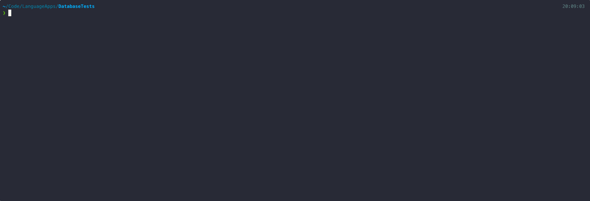

> This repository is poorly named (it has grown way beyond its original scope), and will be renamed.

[](https://github.com/pylint-dev/pylint) [](https://www.buymeacoffee.com/mrbeverage)

# OpenAI Language Quiz Generator

A tool to provide quizzing material for a variety of French language features, and provide feedback for its learners.  What is seen here is it in its command-line application form, but what is within can be consumed by client applications later after further refinement.


> This example is highly rate-limited and with randomised features.

While the overall correctness for right answers has been verified, some of the answers are not always ideomatic (around 10% of the time) given that they are generated with no surrounding context.  This is unavoidable for the time being.

## Getting started

Right now it is a simple Python app, installable from the command line via [Poetry](https://python-poetry.org/):
```
    python -m pip install --upgrade pip
    pip install poetry
    poetry install
```
This app will additiionally require a postgresql database, and an OpenAI API key in your environment.  (This will be configurable, and hidden later.)
```
    # It is probably better to put this into a dotfile:
    export $OPENAI_API_KEY=...
```
A postgresql database is then required, however this is already configured in a docker-compose.yml:
```
    # From the root directory of the repo:
    docker-compose up
```
Better secrets management for both the OpenAI keys and database passwords will be coming shortly when the effort to cloud host this as an API will be undertaken.

Once running, you will need to pre-populate the database with a minimal verb set before any sentence or problem generation.  To do that, run the following:
```
    dbtest database init
```
From there the application is ready to start generating problem data from the command line.  See the documentation below.

## Command Line Usage

## Webserver

This project is eventually meant to become the backend for an already existing language quizzing mobile app.  The most rudimentary of bootstrapping is all that is completed at this point.  It can be started up, and serves a single hardcoded endpoint.
```
    dbtest webserver start
```
Only the `/sentences` endpoint exists, and it is hardcoded to a single verb and question configuration.  It also pulls straight from OpenAI instead of the database, where it really should be pulling from.

This will quickly be built out once remaining major bugs and customization issues with the current tooling is taken care of.

## Examples

## Roadmap
